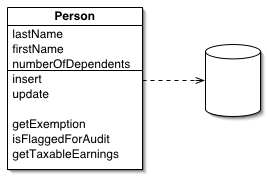

# Active Record  
    
An object carries both data and behavior. Much of this data is persistent and needs to be stored in a database. 
Active Record uses the most obvious approach, putting data access logic in the domain object. This way all people
know how to read and write their data to and from the database.